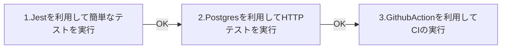

# TypeScript / Node.js でのテスト環境を構築する

テスト環境を段階的に構築し、問題なければ次のステップに移る

## 1. テストフレームワーク **Jest** を使用して簡単なテストを実行する

- jest をインストール
- 簡単なテスト

## 2. **PostgreSQL** を利用して HTTP テストを実行する

- postgres を Docker にインストールする
- **express** を利用したルーティング処理
- 簡単なユーザー登録
- クエリ関数のユニットテスト
- **supertest** を利用して HTTP テストを行う

## 3. Github actions を利用して CI を実行する

- main ブランチに push または pull request をすることで ci を実行するようする
- github/workflows のフォルダに ci の設定ファイルを記述し配置



### 開発環境

- mac
  - os13.0.1
- node version
  - v16.16.0

### npm ライブラリ

```json
"devDependencies": {
    "@types/cookie-parser": "^1.4.3",
    "@types/express": "^4.17.15",
    "@types/jest": "^29.2.5",
    "@types/pg": "^8.6.6",
    "@types/supertest": "^2.0.12",
    "node-pg-migrate": "^6.2.2",
    "supertest": "^6.3.3",
    "ts-jest": "^29.0.3",
    "ts-node": "^10.9.1",
    "typescript": "^4.9.4"
  },
  "dependencies": {
    "cookie-parser": "^1.4.6",
    "express": "^4.18.2",
    "pg": "^8.8.0"
  }

```

### その他必要なツール

- Docker アカウント
- Github アカウント
- Table Plus
- Postman
