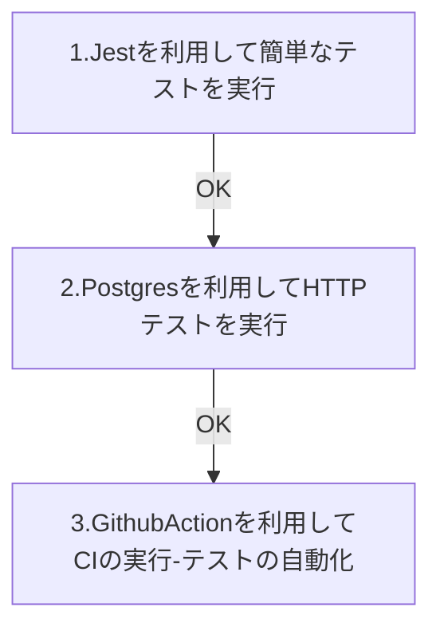

# TypeScript / Node.js でのテスト環境を構築する

テスト環境を段階的に構築し、問題なければ次のステップに移る

## 1. テストフレームワーク **Jest** を使用して簡単なテストを実行する

- jest をインストール
- 簡単なテストを書いてみる

## 2. **PostgreSQL** を利用して HTTP テストを実行する

- postgres を Docker にインストールする
- **express** を利用したルーティング処理
- 簡単なユーザー登録
- 関数のユニットテスト
- **supertest** を利用して HTTP テストを行う

## 3. Github actions を利用して テストを自動化する

- main ブランチに push または pull request をすることで ci を実行するようする
- github/workflows のフォルダに ci の設定ファイルを記述し配置

## 大まかな流れ

### 開発環境

- mac
  - os13.0.1
- node version
  - v16.16.0

### npm ライブラリ

#### 1. Jest を使った簡単なテスト

| ライブラリ名 | version |
| ------------ | ------- |
| ts-jest      | 29.0.3  |
| ts-node      | 10.9.1  |
| typescript   | 4.9.4   |
| @types/jest  | 29.2.5  |

#### 2. Postgres を使った Http テスト

| ライブラリ名     | version |
| ---------------- | ------- |
| express          | 4.18.2  |
| pg               | 8.8.0   |
| supertest        | 6.3.3   |
| @types/express   | 4.17.15 |
| @types/pg        | 8.6.6   |
| @types/supertest | 2.0.12  |

#### 3.その他

| ライブラリ名    | version |
| --------------- | ------- |
| node-pg-migrate | 6.2.2   |

※npx でインストールするため環境を汚さない

### その他必要なツール

- Docker アカウント
- Github アカウント
- Table Plus
- Postman

## 参考サイト

**AWS 継続的インテグレーションとは?**

https://aws.amazon.com/jp/devops/continuous-integration/

> 継続的インテグレーションは、ソフトウェアのリリースプロセスにおけるビルド段階と単体テスト段階のことを指します。リビジョンがコミットされるたびに、自動化されたビルドとテストが開始されます。

> 継続的デリバリーでは、コード変更が自動的にビルドされ、テストされ、運用環境へのリリースに向けて準備されます。継続的デリバリーは、継続的インテグレーションを拡張したもので、すべてのコード変更が、ビルド段階の後にテスト環境または運用環境 (あるいはその両方) にデプロイされます。
